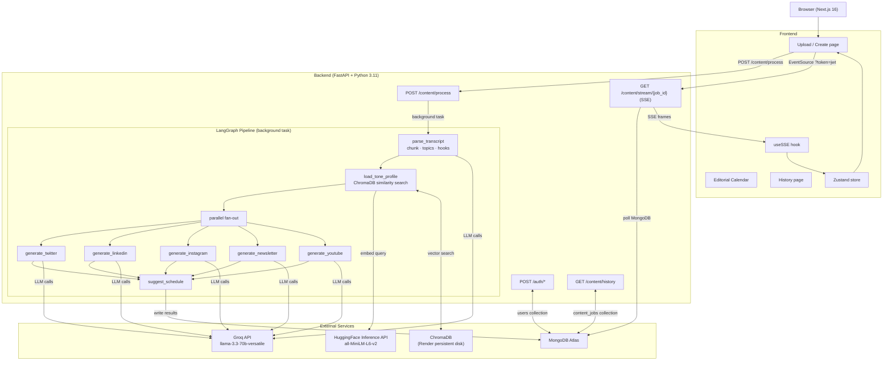

# ContentOS

ContentOS is a full-stack AI content repurposing platform. Paste a video transcript, blog post, or raw notes and a multi-agent pipeline transforms it into platform-native content for Twitter/X, LinkedIn, Instagram, YouTube, and email newsletters — all streamed back to the browser in real time as each agent completes.

Live at: [github.com/sujalambatkar/contentos](https://github.com/sujalambatkar/contentos)

---

## System Architecture



For a detailed breakdown of each component see [docs/architecture.md](docs/architecture.md).

---

## How It Works

1. The user pastes a transcript, blog post, or raw notes (or drops a `.txt`, `.md`, or `.pdf` file).
2. The frontend calls `POST /content/process`, which creates a job record in MongoDB and starts the LangGraph pipeline as a FastAPI background task.
3. The frontend opens a Server-Sent Events connection to `GET /content/stream/{job_id}`. Because `EventSource` cannot send custom headers, the JWT is passed as a `?token` query parameter.
4. The pipeline runs four sequential stages:
   - **parse_transcript** — splits the input into chunks and asks Groq to extract 5-7 key topics and 3 attention hooks.
   - **load_tone_profile** — queries ChromaDB for the user's past content embeddings (via the HuggingFace Inference API) and derives voice traits.
   - **generate_platforms** — five platform agents run in parallel with a 2-second stagger to respect Groq free-tier rate limits. Each agent writes its result directly to MongoDB as it finishes.
   - **suggest_schedule** — appends evidence-based posting-time recommendations per platform.
5. The SSE endpoint polls MongoDB every second and forwards each newly completed platform output as a separate event frame. The frontend renders each card as it arrives.

---

## Tech Stack

| Layer | Technology |
|---|---|
| LLM | Groq API — `llama-3.3-70b-versatile` |
| Embeddings | HuggingFace Inference API — `sentence-transformers/all-MiniLM-L6-v2` |
| Agent orchestration | LangGraph 1.x + LangChain 1.x |
| Backend framework | FastAPI, Python 3.11, Uvicorn |
| Async database driver | Motor (MongoDB) |
| Vector store | ChromaDB (PersistentClient, per-user collections) |
| Database | MongoDB Atlas free cluster |
| Auth | python-jose (JWT, HS256, 7-day expiry), bcrypt |
| Frontend framework | Next.js 16 (App Router), TypeScript |
| Styling | Tailwind CSS v4 |
| Animation | Framer Motion |
| Global state | Zustand with persistence |
| Forms | React Hook Form + Zod |
| HTTP client | Axios with JWT interceptor |
| PDF parsing | pdfjs-dist (client-side, no server upload) |
| Backend deployment | Render free tier (Docker) |
| Frontend deployment | Vercel |

---

## Project Structure

```
contentos/
  backend/
    app/
      main.py                  # FastAPI app, CORS, router registration
      config.py                # pydantic-settings, all env vars
      auth/
        router.py              # /auth/register  /auth/login  /auth/me
        models.py              # Pydantic models for auth
        utils.py               # JWT create/verify, bcrypt hash/verify
      agents/
        orchestrator.py        # LangGraph state machine, parallel fan-out
        transcript_parser.py   # Chunking, topic and hook extraction
        platform_adapter.py    # Five platform content generators
        tone_calibrator.py     # ChromaDB voice profile query and analysis
        scheduler_agent.py     # Posting time recommendations
      api/
        content_router.py      # POST /process, SSE /stream, GET /status
        history_router.py      # GET/DELETE /history, POST /tone/upload
      db/
        mongo.py               # Motor async client, CRUD helpers
        chroma.py              # ChromaDB client, HuggingFace embed calls
      schemas/
        content.py             # ContentJob, ProcessRequest, PlatformOutput
    requirements.txt
    Dockerfile
    render.yaml
  frontend/
    app/
      page.tsx                 # Landing page (unauthenticated) / redirect
      layout.tsx               # Root layout, fonts, Toaster
      (auth)/
        login/page.tsx
        register/page.tsx
      dashboard/
        layout.tsx             # Auth guard, Navbar
        page.tsx               # Editorial calendar
        upload/page.tsx        # Main create page with SSE streaming
        history/page.tsx       # Past generations
      components/
        StreamingOutput.tsx    # SSE consumer, renders cards as they arrive
        PlatformCard.tsx       # Per-platform output card with copy/calendar
        ContentCalendar.tsx    # Drag-drop weekly schedule grid
        ToneProfile.tsx        # Detected voice trait display
        UploadZone.tsx         # Drag-drop + paste + PDF extraction
        Navbar.tsx             # Top navigation with active state
        ToasterProvider.tsx    # Client-only toast wrapper
    lib/
      api.ts                   # Axios client with JWT interceptor
      store.ts                 # Zustand auth + content stores
      sse.ts                   # useSSE hook with token query param
```

---

## Local Setup

### Prerequisites

- Python 3.11 or higher
- Node.js 20 or higher
- A MongoDB Atlas free cluster — [cloud.mongodb.com](https://cloud.mongodb.com)
- Groq API key — [console.groq.com](https://console.groq.com)
- HuggingFace API key (read) — [huggingface.co/settings/tokens](https://huggingface.co/settings/tokens)

### 1. Clone

```bash
git clone https://github.com/sujalambatkar/contentos.git
cd contentos
```

### 2. Backend

```bash
cd backend
python -m venv .venv
source .venv/bin/activate        # Windows: .venv\Scripts\activate
pip install -r requirements.txt

cp .env.example .env
# Fill in GROQ_API_KEY, HF_API_KEY, MONGODB_URI, SECRET_KEY

mkdir -p data/chroma uploads
uvicorn app.main:app --reload --port 8000
```

Interactive API docs available at `http://localhost:8000/docs`.

### 3. Frontend

```bash
cd frontend
npm install
npm run dev
```

App runs at `http://localhost:3000`. The `.env.local` file already points to `http://localhost:8000`.

---

## Environment Variables

### Backend — `backend/.env`

| Variable | Description | Required |
|---|---|---|
| `GROQ_API_KEY` | Groq API key — starts with `gsk_` | Yes |
| `HF_API_KEY` | HuggingFace read token — starts with `hf_` | Yes |
| `MONGODB_URI` | Atlas connection string including database name | Yes |
| `SECRET_KEY` | JWT signing secret, minimum 32 characters | Yes |
| `UPSTASH_REDIS_REST_URL` | Upstash Redis REST URL | Optional |
| `UPSTASH_REDIS_REST_TOKEN` | Upstash Redis REST token | Optional |
| `CHROMA_PATH` | ChromaDB storage path (default: `./data/chroma`) | Optional |
| `UPLOAD_DIR` | File upload directory (default: `./uploads`) | Optional |
| `ALLOWED_ORIGINS` | JSON array of allowed CORS origins | Optional |
| `DEBUG` | Enable debug logging (default: `false`) | Optional |

Generate `SECRET_KEY`:

```bash
python -c "import secrets; print(secrets.token_hex(32))"
```

### Frontend — `frontend/.env.local`

| Variable | Description |
|---|---|
| `NEXT_PUBLIC_API_URL` | Backend base URL (default: `http://localhost:8000`) |

---

## API Reference

### Authentication

All endpoints except `/auth/register` and `/auth/login` require `Authorization: Bearer <token>`.

| Method | Endpoint | Body | Response |
|---|---|---|---|
| POST | `/auth/register` | `{name, email, password}` | `{access_token, user}` |
| POST | `/auth/login` | `{email, password}` | `{access_token, user}` |
| GET | `/auth/me` | — | `{id, name, email, created_at}` |

### Content Pipeline

| Method | Endpoint | Description |
|---|---|---|
| POST | `/content/process` | Start the pipeline. Returns `{job_id}`. |
| GET | `/content/stream/{job_id}` | SSE stream of platform outputs. Pass `?token=<jwt>`. |
| GET | `/content/status/{job_id}` | `{status, completed_platforms, errors}` |
| GET | `/content/history` | List past completed jobs for the current user. |
| GET | `/content/history/{job_id}` | Full job detail including all outputs. |
| DELETE | `/content/history/{job_id}` | Delete a job. |

### Tone Profile

| Method | Endpoint | Body | Description |
|---|---|---|---|
| POST | `/tone/upload` | `{text}` | Store a past writing sample in ChromaDB to calibrate voice. |

### SSE Event Schema

Each event is a `data:` line containing JSON, terminated by `\n\n`.

```
data: {"platform": "twitter",  "content": {...}, "schedule": {...}, "status": "complete"}
data: {"platform": "linkedin", "content": {...}, "schedule": {...}, "status": "complete"}
data: {"type": "meta", "topics": [...], "hooks": [...], "tone_profile": {...}}
data: [DONE]
```

---

## Deployment

### Backend on Render

1. Create a new **Web Service** on [render.com](https://render.com).
2. Select **Docker** as the runtime and point it to `backend/Dockerfile`.
3. Add all required environment variables in the Render dashboard.
4. Add a **Disk** mounted at `/data` (1 GB) for ChromaDB persistence.
5. The health check path is `/health`.

The `backend/render.yaml` file contains the full service definition and can be used with Render's infrastructure-as-code flow.

### Frontend on Vercel

```bash
cd frontend
npx vercel deploy
```

Set the `NEXT_PUBLIC_API_URL` environment variable in the Vercel dashboard to your Render service URL.

---

## Rate Limits and Performance

ContentOS uses the Groq free tier which has a token-per-minute cap. To stay within limits:

- Platform agents start with a 2-second stagger between each call rather than firing all simultaneously.
- Each platform generator has a 90-second hard timeout.
- On the free tier, generating all five platforms typically takes 1.5 to 3 minutes. Selecting fewer platforms is faster.
- LinkedIn uses a shorter prompt (~300 words) compared to other platforms to reduce token consumption.

---

## Contributing

1. Fork the repository.
2. Create a feature branch: `git checkout -b feat/your-feature`
3. Make your changes and write clear commit messages.
4. Open a pull request describing what changed and why.

---

## License

MIT License. See [LICENSE](LICENSE) for details.
